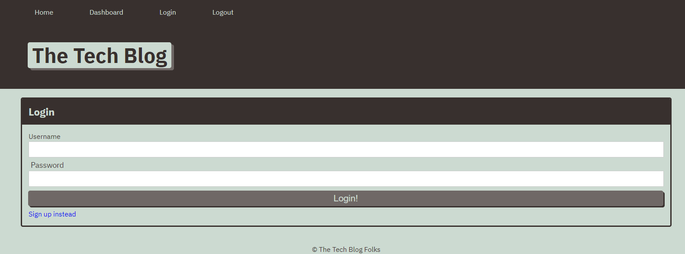

##Tech Blog

## Description

This application allows users to log in to a blog site where they can make posts and publish articles

## Table of Contents

1. [Installation](#installation)
2. [Usage](#usage)
3. [Credits](#usage)
4. [Licensing](#licensing)
5. [Tests](#test)
6. [Questions](#questions)

## Installation

The GitHub Repository can be found here: https://github.com/mbottoms3/CMS_Blog_Site

## Usage

App is deployed to heroku and can be found at: https://enigmatic-meadow-07439.herokuapp.com/

## Credits

My instructor, Benjamin Machock

## Licensing

This project uses the MIT license.

## Tests

NA

## Questions

If there are any questions please reach out to me at bottoms.micah.3@gmail.com

Github profile: [mbottoms3](https://github.com/mbottoms3)

